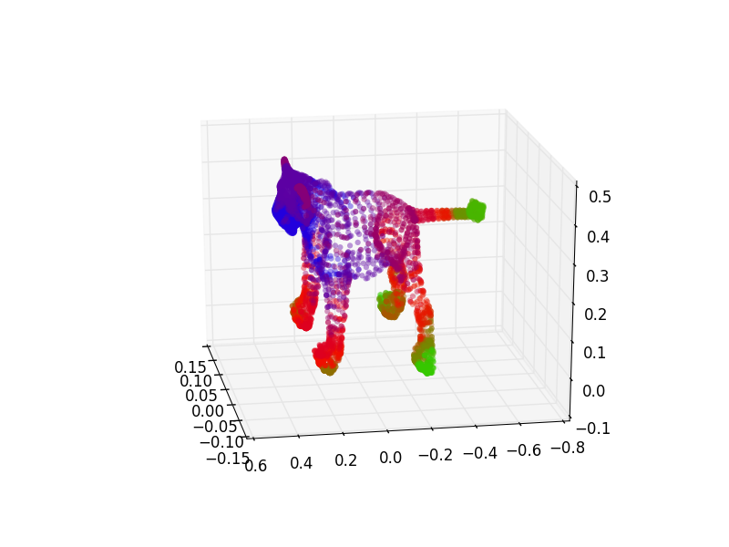
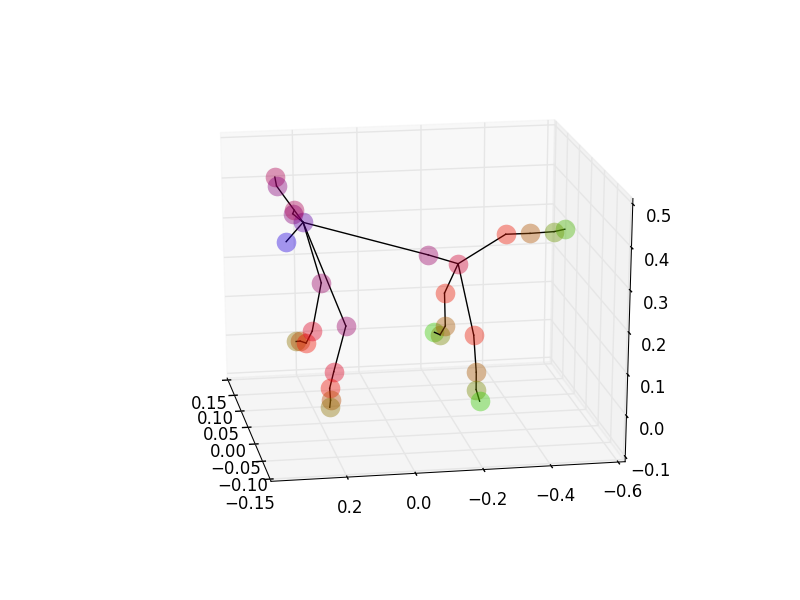
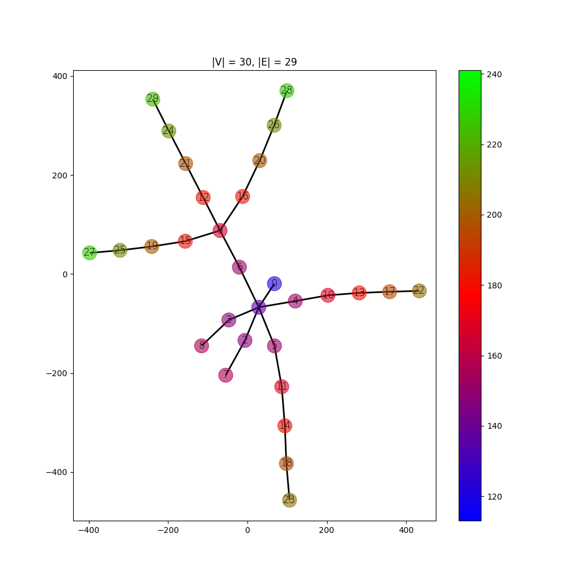
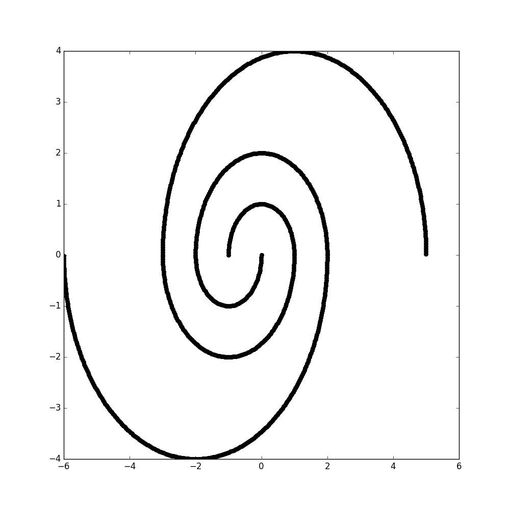
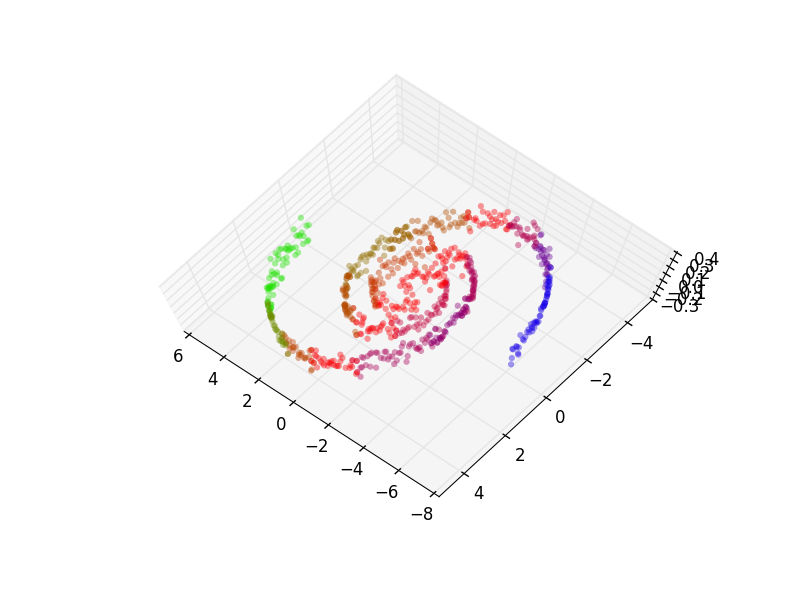
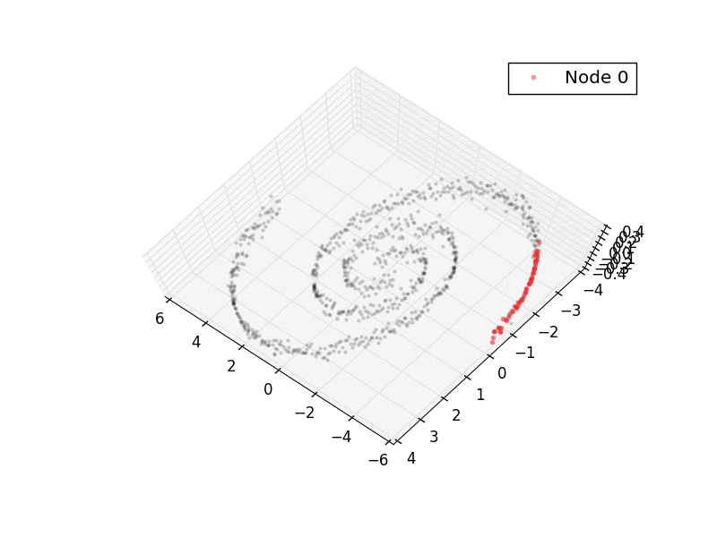
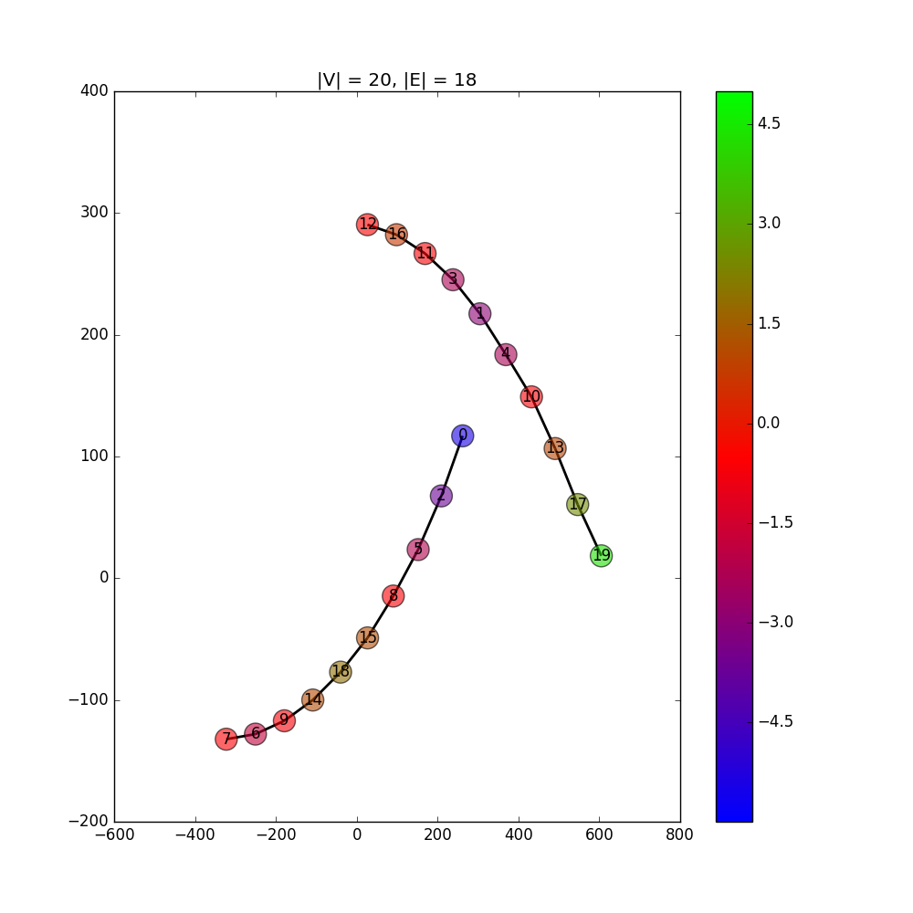

# TDA
## Mapper implementation (Topological Data Analysis for high dimensional dataset exploration)

### Introduction

From [Extracting insights from the shape of complex data using topology](http://www.nature.com/articles/srep01236):

_There are three key ideas of topology that make extracting of patterns via shape possible. Topology takes as its starting point a metric space, by which we mean a set equipped with a numerical notion of distance between any pair of points. The first key idea is that **topology studies shapes in a coordinate free way**. This means that our topological constructions do not depend on the coordinate system chosen, but only on the distance function that specifies the shape. A coordinate free approach allows topology the ability to compare data derived from different platforms (different coordinate systems)._

_The second key idea is that **topology studies the properties of shapes that are invariant under “small” deformations**. To describe small deformations, imagine a printed letter “A” on a rubber sheet, and imagine that the sheet is stretched in some directions. The letter will deform, but the key features, the two legs and the closed triangle remain. In a more mathematical setting, the invariance property means that topologically, a circle, an ellipse, and the boundary of a hexagon are all identical, because by stretching and deforming one can obtain any of these three shapes from any other. The property that these figures share is the fact that they are all loops. This inherent property of topology is what allows it to be far less sensitive to noise and thus, possess the ability to pick out the shape of an object despite countless variations or deformations._

_The third key idea within **topology is that of compressed representations of shapes**. Imagine the perimeter of the Great Salt Lake with all its detail. Often a coarser representation of the lake, such as a polygon, is preferable. Topology deals with finite representations of shapes called triangulations, which means identifying a shape using a finite combinatorial object called a simplicial complex or a network. A prototypical example for this kind of representation is the identification of a circle as having the same shape as a hexagon. The hexagon can be described using only a list of 6 nodes (without any placement in space) and 6 edges, together with data indicating which nodes belong to which edges. This can be regarded as a form of compression, where the number of points went from infinite to finite. Some information is lost in this compression (e.g. curvature), but the important feature, i.e. the presence of a loop, is retained._

_Topological Data Analysis is sensitive to both large and small scale patterns that often fail to be detected by other analysis methods, such as principal component analysis, (PCA), multidimensional scaling, (MDS), and cluster analysis. PCA and MDS produce unstructured scatterplots and clustering methods produce distinct, unrelated groups. These methodologies sometimes obscure geometric features that topological methods capture._

### Results
To test our implementation we take a look at a 3D point dataset of a lion (_lion_data.npy_). We can visualize the point cloud here:

We apply the average L-2 distance as a filter function to our dataset and obtain the following colarization:

Using an overlap of 10% and 8 bins the dataset is seperated according to the projection by the filter function. We cluster each of the intervals individually using Single Linkage Clustering, and now each cluster is represented with a node as can be seen here:

An edge is added between nodes if they share points in common, and thus this 3D dataset can be compressed into a graph:

We can see how the nodes are capturing the topology of the lion. For example we can clearly see that nodes 8 & 7 represent the ears, node 0 is the nose and nodes 22 & 23 the front paws. And as we can see below, node 29 is the fur of the tail with 27 & 28 being the back paws).

We can also take a look at a more abstract example of two spirals in the following configuration:

Add gaussian noise in the z dimension, we proceed analogously to the lion example. This time use the x axis as a filter function (different filter functions will give us different compressions or views of the dataset), taking 4% and 7 bins.

Following is a visualization of the overlapping binning process based on the filter function. Nearest-Neighbour chain was used for the clustering.

After applying the Mapper algorithm, the two spirals have been successfully disentangled as can be seen in the graph representation.

